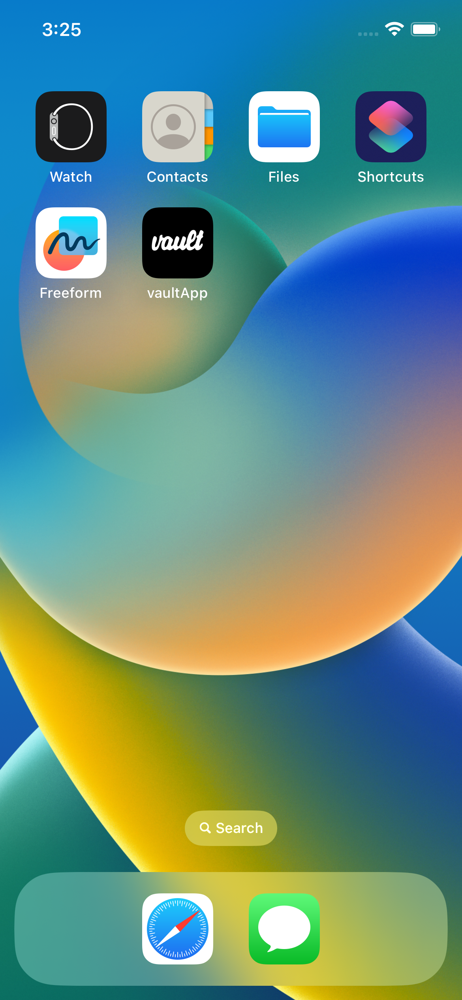

### Cloning the project and installing dependencies 

1. To get started, clone this repository using the following git command
```
git clone https://github.com/SDS2016/vault.git
```

2. Once the repo has been cloned, in your terminal cd into the project folder, make sure you're working in a seperate branch and run the command below to install all the required packages and libraries.

```
npm install
```


## Running the iOS application

1. To run the iOS app after installing all the required npm packages and libraries, cd into the ios folder ```cd ios``` and run ```pod install``` to install the app's pods. If you encounter an error when installing the pods on an Apple M1 machine run these commands instead: ```sudo arch -x86_64 gem install ffi``` and then  ```arch -x86_64 pod install```


2. Once the pods have been installed open the ```vaultApp.xcworkspace``` file in the ios folder. In Xcode: 
* 2.1 Clean the build folder
* 2.2 Build the application


### Running the app on an iOS simulator

After cleaning and buidling the application simply run the application in your preffered iOS simulator


### Current App Screenshots


